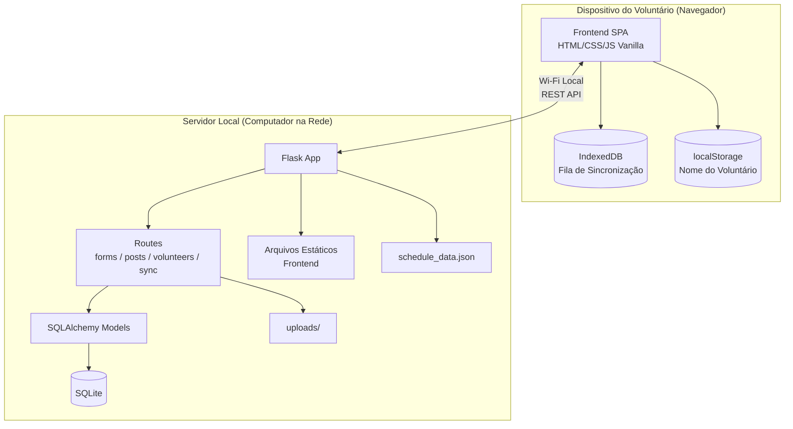
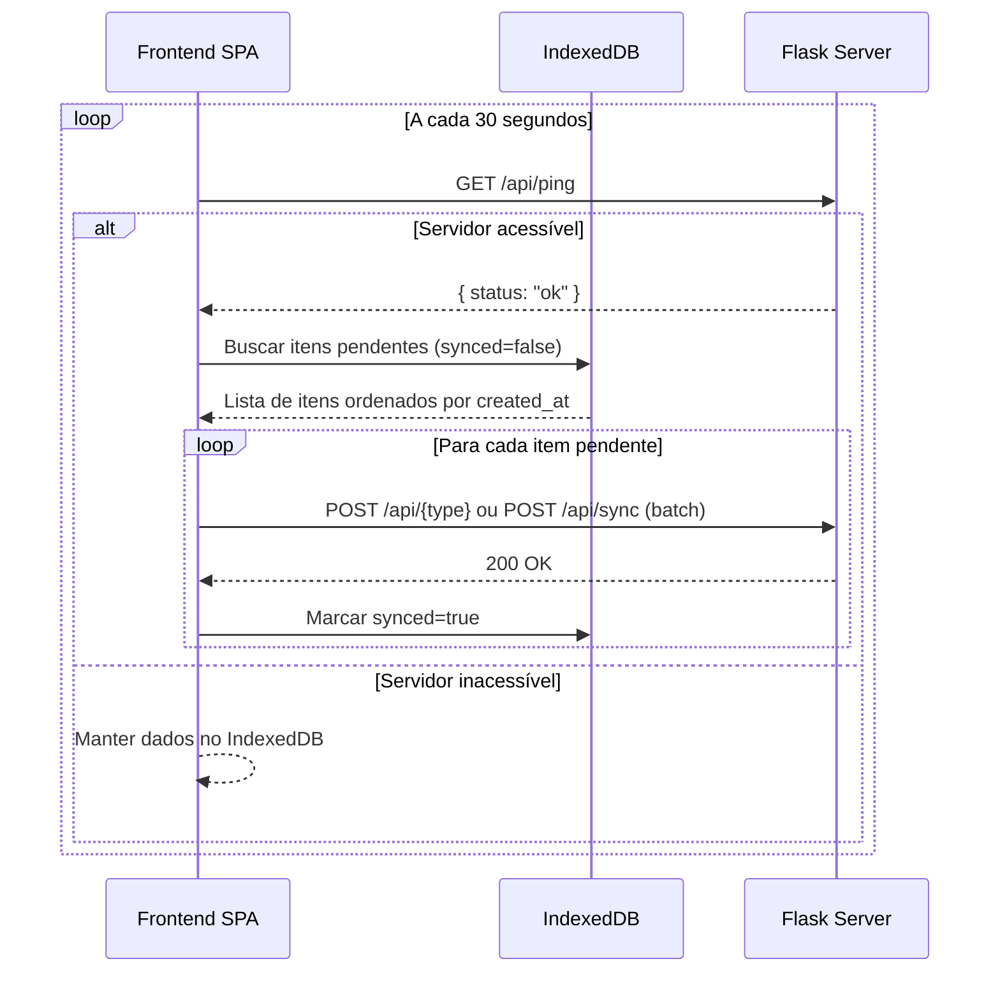
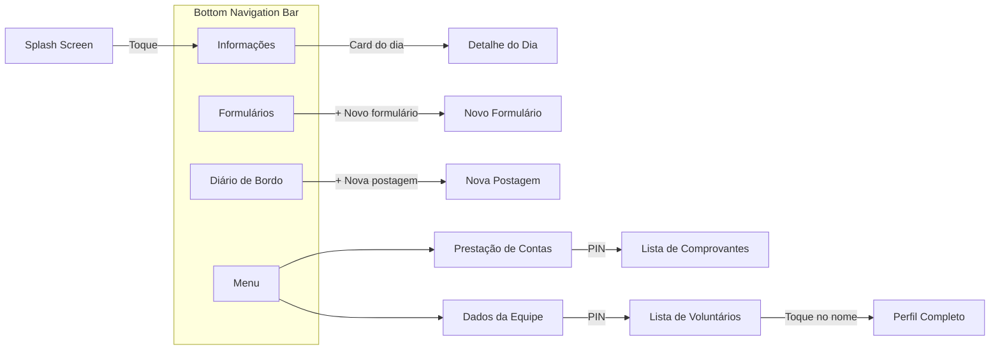

# Documento de Design — IPRA no Ariri

## Visão Geral

O IPRA no Ariri é um aplicativo web progressivo (SPA) para apoiar uma missão social cristã de 4 dias, operando em ambiente offline-first com sincronização via rede Wi-Fi local. O sistema é composto por um backend Flask servindo API REST e arquivos estáticos, e um frontend em HTML/CSS/JavaScript vanilla com persistência local via IndexedDB.

O app atende 12–15 voluntários em seus dispositivos móveis, conectados a um servidor central (computador local rodando Flask + SQLite). A arquitetura prioriza resiliência offline: todas as operações de escrita são salvas localmente primeiro e sincronizadas automaticamente quando o servidor está acessível.

### Decisões Arquiteturais Chave

1. **Offline-first**: Toda escrita vai para IndexedDB primeiro; sincronização é assíncrona e automática.
2. **SPA sem framework**: Roteamento client-side com hash-based routing (`#/page`), sem dependência de React/Vue/Angular.
3. **Flask como servidor único**: Serve API + arquivos estáticos, eliminando necessidade de servidor web separado.
4. **Sem internet externa**: Todos os recursos (fontes, ícones, CSS) devem ser bundled localmente.
5. **Redimensionamento client-side**: Imagens são processadas no navegador antes do envio via Canvas API.

---

## Arquitetura

### Diagrama de Arquitetura Geral



### Diagrama de Fluxo de Sincronização



### Fluxo de Navegação SPA



---

## Componentes e Interfaces

### Backend (Flask)

#### `app.py` — Aplicação Principal

- Inicializa Flask, configura SQLAlchemy e CORS
- Registra blueprints de rotas
- Configura servir arquivos estáticos do frontend
- Define rota catch-all para SPA (retorna `index.html`)

```python
# Interface principal
def create_app() -> Flask:
    """Cria e configura a aplicação Flask."""
    pass
```

#### `models.py` — Modelos SQLAlchemy

| Modelo | Campos Principais |
|--------|-------------------|
| `Form` | id, volunteer_name, actions (JSON), full_name, age, locality, description, image_path, created_at |
| `Post` | id, volunteer_name, title, description, image_path, created_at |
| `Receipt` | id, title, description, image_path, created_at |
| `Volunteer` | id, full_name, profile_image, rg, cpf, birth_date, gender, profession, email, phone, address, terms_path, medical_data_path |

#### Rotas (Blueprints)

| Blueprint | Endpoint | Método | Descrição |
|-----------|----------|--------|-----------|
| `ping` | `/api/ping` | GET | Health check — retorna `{ "status": "ok" }` |
| `forms` | `/api/forms` | POST | Salvar formulário |
| `forms` | `/api/forms` | GET | Listar formulários |
| `posts` | `/api/posts` | POST | Salvar postagem |
| `posts` | `/api/posts` | GET | Listar postagens |
| `receipts` | `/api/receipts` | POST | Salvar comprovante |
| `receipts` | `/api/receipts` | GET | Listar comprovantes |
| `volunteers` | `/api/volunteers` | GET | Listar voluntários |
| `volunteers` | `/api/volunteers/<id>` | GET | Perfil completo |
| `schedule` | `/api/schedule` | GET | Dados do cronograma |
| `sync` | `/api/sync` | POST | Sincronização em lote |

#### Interface do Endpoint `/api/sync`

```json
// Request body (POST /api/sync)
{
  "items": [
    {
      "id": "uuid-local",
      "type": "form" | "post" | "receipt",
      "data": { /* campos do item */ },
      "created_at": "2025-01-01T10:00:00Z"
    }
  ]
}

// Response
{
  "synced": ["uuid-1", "uuid-2"],
  "errors": [
    { "id": "uuid-3", "error": "mensagem de erro" }
  ]
}
```

### Frontend (JavaScript Vanilla)

#### `app.js` — Roteador SPA

- Hash-based routing (`window.location.hash`)
- Mapeamento de rotas para funções de renderização
- Gerenciamento de estado da Bottom Navigation Bar

```javascript
// Interface do roteador
const routes = {
  '': renderSplash,
  '#/info': renderInfo,
  '#/info/:day': renderDayDetail,
  '#/forms': renderForms,
  '#/forms/new': renderNewForm,
  '#/diary': renderDiary,
  '#/diary/new': renderNewPost,
  '#/menu': renderMenu,
  '#/menu/accounts': renderAccounts,
  '#/menu/accounts/new': renderNewReceipt,
  '#/menu/team': renderTeam,
  '#/menu/team/:id': renderVolunteerProfile
};
```

#### `db.js` — Helper IndexedDB

```javascript
// Interface pública
const DB = {
  init(): Promise<IDBDatabase>,
  addPending(store: string, item: object): Promise<string>,
  getPending(store: string): Promise<Array>,
  markSynced(store: string, id: string): Promise<void>,
  clearSynced(store: string): Promise<void>
};
```

Stores IndexedDB:
- `pending_forms` — formulários aguardando sincronização
- `pending_posts` — postagens aguardando sincronização
- `pending_receipts` — comprovantes aguardando sincronização

Cada registro segue o schema:
```javascript
{
  id: crypto.randomUUID(),   // UUID gerado no cliente
  type: 'form' | 'post' | 'receipt',
  data: { /* campos do formulário/post/comprovante */ },
  created_at: new Date().toISOString(),
  synced: false
}
```

#### `sync.js` — Lógica de Sincronização

```javascript
// Interface pública
const Sync = {
  start(): void,              // Inicia polling a cada 30s
  stop(): void,               // Para o polling
  ping(): Promise<boolean>,   // Verifica conectividade
  syncAll(): Promise<SyncResult>,  // Sincroniza todos os pendentes
  getServerUrl(): string,     // Retorna URL base configurada
  setServerUrl(url: string): void  // Configura URL base
};
```

#### `pages/*.js` — Módulos de Página

Cada página exporta uma função `render(container, params)` que:
1. Limpa o container
2. Renderiza o HTML da página
3. Anexa event listeners
4. Retorna cleanup function (opcional)

#### Utilitário de Redimensionamento de Imagem

```javascript
// Interface
async function resizeImage(file: File, maxDimension: number = 1200, quality: number = 0.8): Promise<Blob>
```

Usa Canvas API para:
1. Carregar imagem em `Image` element
2. Calcular dimensões mantendo proporção (max 1200px)
3. Desenhar em canvas redimensionado
4. Exportar como JPEG com qualidade 80%

---

## Modelos de Dados

### Backend — SQLAlchemy Models

```python
class Form(db.Model):
    id = db.Column(db.String(36), primary_key=True)  # UUID
    volunteer_name = db.Column(db.String(100), nullable=False)
    actions = db.Column(db.JSON, nullable=False)  # Lista de ações selecionadas
    full_name = db.Column(db.String(200))
    age = db.Column(db.Integer)
    locality = db.Column(db.String(200))
    description = db.Column(db.Text)
    image_path = db.Column(db.String(500))
    created_at = db.Column(db.DateTime, default=datetime.utcnow)

class Post(db.Model):
    id = db.Column(db.String(36), primary_key=True)
    volunteer_name = db.Column(db.String(100), nullable=False)
    title = db.Column(db.String(300), nullable=False)
    description = db.Column(db.Text)
    image_path = db.Column(db.String(500))
    created_at = db.Column(db.DateTime, default=datetime.utcnow)

class Receipt(db.Model):
    id = db.Column(db.String(36), primary_key=True)
    title = db.Column(db.String(300), nullable=False)
    description = db.Column(db.Text)
    image_path = db.Column(db.String(500))
    created_at = db.Column(db.DateTime, default=datetime.utcnow)

class Volunteer(db.Model):
    id = db.Column(db.Integer, primary_key=True, autoincrement=True)
    full_name = db.Column(db.String(200), nullable=False)
    profile_image = db.Column(db.String(500))
    rg = db.Column(db.String(20))
    cpf = db.Column(db.String(14))
    birth_date = db.Column(db.Date)
    gender = db.Column(db.String(20))
    profession = db.Column(db.String(100))
    email = db.Column(db.String(200))
    phone = db.Column(db.String(20))
    address = db.Column(db.Text)
    terms_path = db.Column(db.String(500))
    medical_data_path = db.Column(db.String(500))
```

### Frontend — IndexedDB Stores

```javascript
// Store: pending_forms
{
  id: "550e8400-e29b-41d4-a716-446655440000",
  type: "form",
  data: {
    volunteer_name: "Maria",
    actions: ["Evangelismo", "Oração"],
    full_name: "João da Silva",
    age: 45,
    locality: "Comunidade Ariri",
    description: "Visita domiciliar",
    image: "data:image/jpeg;base64,..."  // Base64 da imagem redimensionada
  },
  created_at: "2025-07-15T14:30:00.000Z",
  synced: false
}

// Store: pending_posts
{
  id: "660e8400-e29b-41d4-a716-446655440001",
  type: "post",
  data: {
    volunteer_name: "Pedro",
    title: "Primeiro dia de missão",
    description: "Hoje foi um dia abençoado...",
    image: "data:image/jpeg;base64,..."
  },
  created_at: "2025-07-15T18:00:00.000Z",
  synced: false
}

// Store: pending_receipts
{
  id: "770e8400-e29b-41d4-a716-446655440002",
  type: "receipt",
  data: {
    title: "Compra de materiais",
    description: "Materiais para atividade infantil",
    image: "data:image/jpeg;base64,..."
  },
  created_at: "2025-07-15T09:00:00.000Z",
  synced: false
}
```

### Estrutura do `schedule_data.json`

```json
{
  "days": [
    {
      "id": "sabado",
      "label": "Sábado",
      "date": "2025-07-19",
      "schedule": [
        { "time": "07:00", "activity": "Café da manhã" },
        { "time": "08:00", "activity": "Devocional" }
      ],
      "menu": {
        "breakfast": "Pão, café, frutas",
        "lunch": "Arroz, feijão, frango",
        "dinner": "Sopa"
      },
      "materials": [
        "Bíblias",
        "Material infantil",
        "Kit odontológico"
      ]
    }
  ]
}
```

### localStorage

| Chave | Tipo | Descrição |
|-------|------|-----------|
| `volunteer_name` | string | Nome do voluntário identificado |
| `server_url` | string | URL base do servidor (ex: `http://192.168.1.100:5000`) |

---

## Propriedades de Corretude

*Uma propriedade é uma característica ou comportamento que deve ser verdadeiro em todas as execuções válidas de um sistema — essencialmente, uma declaração formal sobre o que o sistema deve fazer. Propriedades servem como ponte entre especificações legíveis por humanos e garantias de corretude verificáveis por máquina.*

### Propriedade 1: Round-trip de localStorage

*Para qualquer* string de nome de voluntário válida (não vazia) e qualquer URL de servidor válida, salvar o valor no localStorage e ler de volta deve retornar exatamente o mesmo valor.

**Valida: Requisitos 2.2, 17.1**

### Propriedade 2: Nome do autor injetado em submissões

*Para qualquer* nome de voluntário salvo no localStorage, ao criar um formulário ou postagem, o campo `volunteer_name` nos dados submetidos deve conter exatamente o nome salvo.

**Valida: Requisitos 2.3, 7.3**

### Propriedade 3: Navegação SPA e destaque do ícone ativo

*Para qualquer* rota válida do app, navegar para ela deve atualizar o conteúdo do container principal sem recarregar a página, e o ícone correspondente na Bottom Navigation Bar deve ter a classe CSS de destaque enquanto os demais não.

**Valida: Requisitos 3.2, 3.3**

### Propriedade 4: Renderização fiel dos dados do cronograma

*Para qualquer* estrutura válida de `schedule_data.json` contendo dias com cronograma, cardápio e materiais, a renderização da página de detalhe do dia deve conter todas as atividades, itens de cardápio e materiais presentes nos dados de entrada.

**Valida: Requisitos 4.3**

### Propriedade 5: Validação de ações do formulário

*Para qualquer* subconjunto das ações disponíveis (incluindo o conjunto vazio), a validação do formulário deve aceitar a submissão se e somente se ao menos uma ação está selecionada.

**Valida: Requisitos 5.4**

### Propriedade 6: Agregação correta dos dados do dashboard

*Para qualquer* conjunto de formulários com ações variadas, a contagem por tipo de ação no gráfico de barras deve corresponder exatamente ao número de formulários que contêm cada ação, e os percentuais do gráfico de pizza devem somar 100% (com tolerância de ±1% por arredondamento) e ser proporcionais às contagens.

**Valida: Requisitos 6.2, 6.3**

### Propriedade 7: Ordenação do feed do Diário de Bordo

*Para qualquer* conjunto de postagens com datas variadas, o feed renderizado deve estar ordenado por data decrescente (mais recente primeiro).

**Valida: Requisitos 7.1**

### Propriedade 8: Validação de PIN

*Para qualquer* PIN de 4 dígitos numéricos, a validação deve conceder acesso se e somente se o PIN informado corresponde exatamente ao PIN configurado no servidor.

**Valida: Requisitos 8.2, 9.2**

### Propriedade 9: Renderização completa do perfil do voluntário

*Para qualquer* voluntário com dados completos, a renderização do perfil deve conter todos os campos obrigatórios: nome completo, RG, CPF, data de nascimento, sexo, profissão, e-mail, telefone, endereço, termos e dados médicos.

**Valida: Requisitos 9.4**

### Propriedade 10: Persistência offline no IndexedDB

*Para qualquer* item válido (formulário, postagem ou comprovante), ao salvar em modo offline, o registro no IndexedDB deve conter: id (UUID v4 válido), type correspondente ao tipo do item, data com todos os campos do item original, created_at como string ISO 8601, e synced igual a false.

**Valida: Requisitos 11.1, 11.2, 11.3**

### Propriedade 11: Sincronização em ordem cronológica

*Para qualquer* conjunto de itens pendentes no IndexedDB com timestamps `created_at` variados, a ordem de envio ao servidor durante a sincronização deve ser crescente por `created_at`.

**Valida: Requisitos 12.2**

### Propriedade 12: Marcação de synced após envio bem-sucedido

*Para qualquer* item pendente no IndexedDB, após sincronização bem-sucedida com o servidor, o campo `synced` do registro deve ser atualizado para `true`.

**Valida: Requisitos 12.3**

### Propriedade 13: Redimensionamento de imagem preserva proporção e respeita limite

*Para qualquer* imagem com dimensões (largura, altura) maiores que zero, o redimensionamento deve produzir dimensões onde: (a) a maior dimensão não excede 1200 pixels, (b) a proporção largura/altura original é mantida (com tolerância de ±1 pixel por arredondamento), e (c) imagens já menores que 1200px não são ampliadas.

**Valida: Requisitos 13.1**

---

## Tratamento de Erros

### Frontend

| Cenário | Comportamento |
|---------|---------------|
| Servidor inacessível durante envio | Salvar no IndexedDB, exibir indicador "offline" discreto |
| Falha na sincronização de um item | Manter item na fila, tentar novamente no próximo ciclo de 30s |
| PIN incorreto | Exibir mensagem "PIN incorreto" e manter na tela de PIN |
| Formulário inválido (sem ação selecionada) | Exibir mensagem de validação, impedir envio |
| Erro ao redimensionar imagem | Exibir mensagem de erro, permitir tentar novamente |
| IndexedDB indisponível | Exibir aviso de que o modo offline não está disponível |
| Erro ao carregar schedule_data.json | Exibir mensagem "Dados não disponíveis" na página de informações |
| Imagem muito grande para base64 | Redimensionar antes de converter; se ainda falhar, informar o usuário |

### Backend

| Cenário | Comportamento | Código HTTP |
|---------|---------------|-------------|
| Dados inválidos no POST | Retornar erro com detalhes | 400 Bad Request |
| Recurso não encontrado | Retornar mensagem descritiva | 404 Not Found |
| Erro interno do servidor | Log do erro, retornar mensagem genérica | 500 Internal Server Error |
| Upload de imagem falha | Retornar erro com detalhes | 400 Bad Request |
| ID duplicado no sync (item já existe) | Ignorar item, retornar como "já sincronizado" | 200 OK (com nota) |
| Arquivo schedule_data.json ausente | Retornar JSON vazio com aviso | 200 OK (com aviso) |

### Indicador de Conectividade

O frontend deve exibir um indicador visual discreto do estado de conexão:
- **Online** (verde): Servidor acessível, dados sincronizados
- **Pendente** (amarelo): Servidor acessível, sincronização em andamento
- **Offline** (vermelho): Servidor inacessível, dados salvos localmente

---

## Estratégia de Testes

### Abordagem Dual: Testes Unitários + Testes de Propriedade

A estratégia combina testes unitários (exemplos específicos) com testes baseados em propriedades (verificação universal) para cobertura abrangente.

### Testes Baseados em Propriedades (PBT)

**Biblioteca**: [Hypothesis](https://hypothesis.readthedocs.io/) para Python (backend) e [fast-check](https://fast-check.dev/) para JavaScript (frontend).

**Configuração**:
- Mínimo de 100 iterações por teste de propriedade
- Cada teste deve referenciar a propriedade do documento de design
- Formato de tag: `Feature: ipra-no-ariri, Property {número}: {texto da propriedade}`

**Propriedades a implementar**:

| # | Propriedade | Camada | Biblioteca |
|---|-------------|--------|------------|
| 1 | Round-trip de localStorage | Frontend | fast-check |
| 2 | Nome do autor injetado | Frontend | fast-check |
| 3 | Navegação SPA e ícone ativo | Frontend | fast-check |
| 4 | Renderização de dados do cronograma | Frontend | fast-check |
| 5 | Validação de ações do formulário | Frontend | fast-check |
| 6 | Agregação de dados do dashboard | Frontend | fast-check |
| 7 | Ordenação do feed por data | Frontend | fast-check |
| 8 | Validação de PIN | Frontend | fast-check |
| 9 | Renderização do perfil do voluntário | Frontend | fast-check |
| 10 | Persistência offline no IndexedDB | Frontend | fast-check |
| 11 | Sincronização em ordem cronológica | Frontend | fast-check |
| 12 | Marcação de synced após envio | Frontend | fast-check |
| 13 | Redimensionamento de imagem | Frontend | fast-check |

### Testes Unitários (Exemplos e Edge Cases)

**Backend (pytest)**:
- Testes de cada endpoint da API (POST/GET) com dados concretos
- Testes de validação de dados de entrada
- Testes do endpoint `/api/sync` com batch de itens
- Testes de tratamento de erros (400, 404, 500)
- Testes de servir arquivos estáticos

**Frontend (Jest ou Vitest)**:
- Testes de renderização da Splash Screen (elementos, versículo)
- Testes de navegação (click em ícones, cards)
- Testes de presença de campos em formulários
- Testes de exibição/ocultação do dashboard
- Testes de prompt de PIN

### Testes de Integração

- Fluxo completo: criar formulário offline → sincronizar → verificar no servidor
- Fluxo de autenticação por PIN
- Carregamento de dados do schedule_data.json
- Upload e redimensionamento de imagem end-to-end

### Testes Smoke

- `GET /api/ping` retorna `{ "status": "ok" }`
- Flask serve `index.html` na rota raiz
- SQLite é o banco configurado
- 3 stores existem no IndexedDB após inicialização
